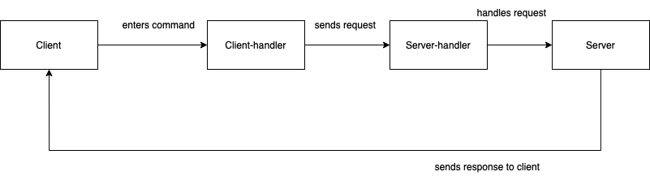

# TCP Server
This project contains an implementation of a TCP client-server app. It also provides an interface an http api for a [server dashboard](https://github.com/manu-yaff/server-dashboard).

This project was built with the programming language GO. It uses the `net` package provided by the standard library, which allows the creation of connections at the TCP level.

### Features
See [features](./us.md)

### Technologies

### Third party libraries used
- [Gin webframework](github.com/gin-gonic/gin)
- [CORS gin's middleware](github.com/gin-contrib/cors)

### Running the program
- To execute the server navigate to [/server-cli/main.go](./server-cli/main.go)
  - Run `go run main.go`
- To execute the client navigate to [/client-cli/main.go](./client-cli/main.go)  
  - Run `go run main.go`
- To execute tests
  - Run `go test` inside the test folder

### File Structure

- api/
  - Contains the api related functions. Two endpoints can be found, one to obtain the clients connected to the server and the other, to get the information related to
- channel/
  - Defines the channel stuct and its functions such as: brodcast, hasMember, removeClientFromChannel
- client/
  - Defines the client struct and functions to connect to the tcp-server as well as read the responses from the server
- client-cli/
  - Here the main file is executed to run the program. Here is where the client connects, keeps the connection open, handles server input and client's commands
- client-handler/
  - This handles takes care of the logic required for each command on the client side. This includes arguments validations, among other actions
- file/
  - Defines the file struct
- request/
  - Defines the request struct
- response/
  - Defines the response struct
- server/
  - Contains the main program to run the server. It can also be found the server handler, which has the server functions to handle the client's request
- tests/
  - Test for the most relevant functions are found here
- utils/
  - Constains utility functions that are used in other files. For instance, fuctions to get the current time, check file existance, write to a connection, etc.

### Program flow
- Simple flow of the program can be seen in this image

### Commands available for the client

- `/name [name]` -> sets the name of your user, by default is Anonymus"
- `/create [channel]` -> creates a channel
- `/join [channel]` -> joins a channel
- `/list` -> displays all the channels available
- `/leave [channel]` -> leaves a channel. Stops receiving information from there
- `/create` [channel]` -> creates a channel
- `/send [file] [channel]` -> sends file through channel
  - note: file has to be in the current dir
- `/files` -> list all files in the current user's directory
- `/open [file]` -> opens file")